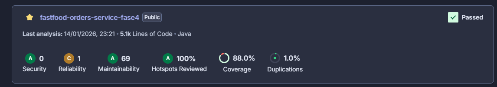

# FastFood Order Service

## Pipeline de deploy e testes

O projeto conta com uma pipeline automatizada que executa **build**, **testes automatizados** e **análise de qualidade** a cada alteração. Após a validação dos testes e das regras de qualidade, a aplicação é preparada para deploy no ambiente configurado.

Durante a pipeline, os testes são executados e a cobertura de código é enviada para o **SonarCloud**, garantindo um nível mínimo de qualidade antes da entrega.

---

## Endpoints

### Criar cliente

**POST**
```
<EndpointAws>/fastfood-orderservice/clientes
```

**Body:**
```json
{
  "name": "Nome do cliente",
  "email": "nome.cliente@email.com",
  "cpf": "12345678965"
}
```

---

### Criar pedido

**POST**
```
<EndpointAws>/fastfood-orderservice/orders
```

**Body:**
```json
{
  "client_public_id": "uuid-do-cliente",
  "products": [
    { "product_id": 1, "quantity": 1 },
    { "product_id": 2, "quantity": 3 },
    { "product_id": 3, "quantity": 2 }
  ]
}
```

---

### Listar pedidos

**GET**
```
<EndpointAws>/fastfood-orderservice/orders?only_paid=false&page=0&per_page=10&sort=orderNumber&dir=asc&search=
```

---

## Headers obrigatórios

Em **todos os endpoints**, é necessário enviar o seguinte header:

```
Key: Host
Value: fastfood-orderservice.example.com
```

---

## Qualidade e cobertura de testes

O projeto utiliza o **SonarCloud** para análise estática de código e acompanhamento da cobertura de testes. Atualmente, a aplicação conta com **88% de cobertura de testes**, validada pelo SonarCloud.

